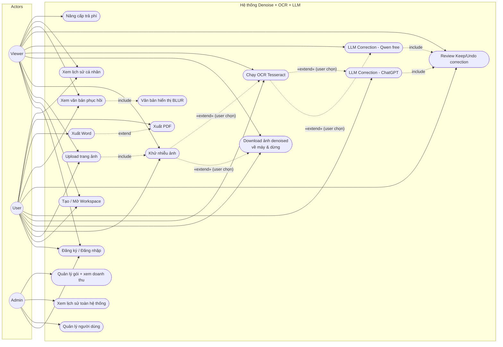
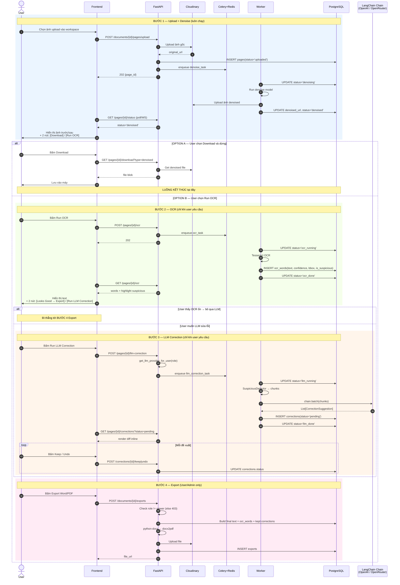
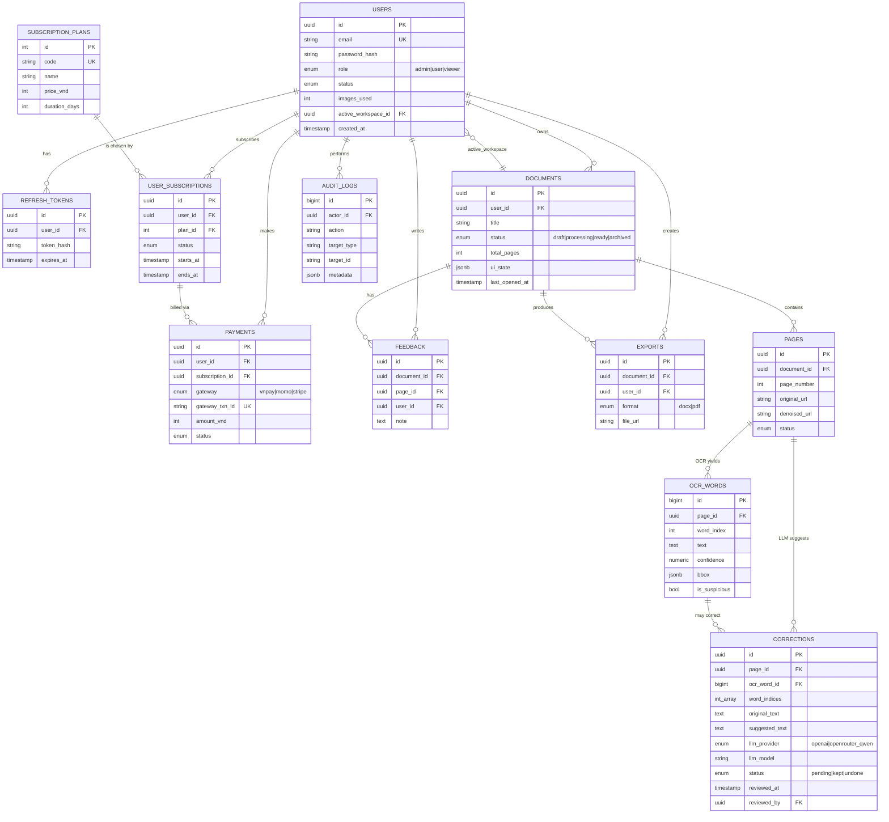

# Thiết kế hệ thống dự án khử nhiễu + OCR + LLM Correction (Phiên bản 2)

## Context

Hệ thống web cho phép người dùng upload ảnh tài liệu (từng trang sách), khử nhiễu bằng model tự xây. **Sau mỗi bước, user chủ động quyết định bước tiếp theo** (pipeline KHÔNG chạy tự động xuyên suốt):

1. Khử nhiễu xong → user có thể **download ảnh denoised về máy và dừng**, hoặc **bấm "Run OCR"** để trích văn bản.
2. OCR xong → user xem kết quả; nếu thấy OCR ổn → **bỏ qua LLM**, đi thẳng tới export. Nếu chưa ổn → **bấm "Run LLM Correction"** để LLM đề xuất sửa các từ confidence thấp.
3. LLM trả gợi ý → user review từng đề xuất bằng **Keep / Undo** giống GitHub Copilot.
4. Cuối cùng xuất Word/PDF.

Hỗ trợ **nhiều workspace song song** (mỗi cuốn sách = 1 workspace, mở workspace khác vẫn giữ nguyên state cuốn cũ).

3 role: **Admin / User / Viewer**. Viewer bị giới hạn 10 ảnh, văn bản blur, không xuất file; LLM dùng **Qwen free (OpenRouter)**. User trả phí dùng **ChatGPT API**. Admin quản lý toàn bộ.

Tài liệu này chốt: cấu trúc thư mục (bám theo `readme.md` đã có), lược đồ DB, luồng nghiệp vụ, và **3 sơ đồ** (Use Case, Sequence, ERD).

---

## 1. Quyết định công nghệ đã chốt

| Mục | Lựa chọn |
|---|---|
| Backend | Python + FastAPI |
| Database | PostgreSQL |
| Denoise | Model tự xây (OpenCV / Autoencoder) trong `app/ai/denoising/` |
| OCR | Tesseract local (option: PaddleOCR) trong `app/ai/ocr/` |
| LLM Correction | **LangChain chains** trong `app/ai/llm/chains/` — User: OpenAI ChatGPT; Viewer: Qwen free qua OpenRouter |
| Lưu ảnh | Cloudinary (ảnh gốc + ảnh denoised) |
| Auth | JWT (access + refresh), refresh hash lưu DB |
| Async | Celery + Redis (denoise, OCR, LLM correction) |
| Payment | VNPay / MoMo / Stripe (subscription) |
| Xuất file | `python-docx` → `docx2pdf` / LibreOffice headless |

---

## 2. Role & Quyền hạn

### 2.1. Ma trận quyền

| Chức năng | Viewer | User | Admin |
|---|:---:|:---:|:---:|
| Đăng ký / đăng nhập | ✅ | ✅ | ✅ |
| Tạo workspace (document/cuốn sách) | ✅ (≤ 2 workspace) | ✅ (không giới hạn) | ✅ |
| Upload trang (page) vào workspace | ✅ (≤ 10 page **tổng**) | ✅ | ✅ |
| Khử nhiễu ảnh | ✅ | ✅ | ✅ |
| **Download ảnh denoised về máy (dừng ở đây)** | ✅ | ✅ | ✅ |
| Quyết định có chạy OCR hay không | ✅ | ✅ | ✅ |
| Trích OCR (tùy chọn) | ✅ | ✅ | ✅ |
| Quyết định có gọi LLM correction hay không | ✅ | ✅ | ✅ |
| LLM correction (tùy chọn) | ✅ (Qwen free) | ✅ (ChatGPT) | ✅ |
| Review Keep/Undo từng correction | ✅ | ✅ | ✅ |
| Xem text đầy đủ sau phục hồi | ⚠️ **Blur** | ✅ | ✅ |
| Xuất Word (.docx) | ❌ | ✅ | ✅ |
| Xuất PDF | ❌ | ✅ | ✅ |
| Mở nhiều workspace song song & giữ state | ✅ | ✅ | ✅ |
| Xem lịch sử phục hồi của chính mình | ✅ | ✅ | ✅ |
| Nâng cấp tài khoản (payment) | ✅ | — | — |
| Quản lý user (CRUD, ban, role) | ❌ | ❌ | ✅ |
| Xem lịch sử của mọi user | ❌ | ❌ | ✅ |
| Dashboard thống kê + doanh thu | ❌ | ❌ | ✅ |

### 2.2. Giới hạn Viewer

- `images_used ≤ 10` (toàn bộ vòng đời, không reset).
- LLM provider: ép sang Qwen free OpenRouter (chọn ở runtime theo role).
- Backend trả text đầy đủ **kèm flag `blurred=true`** → frontend phủ blur. Endpoint `/exports/*` trả 403.
- Sau khi thanh toán: role → `user`, `images_used` reset 0, LLM provider chuyển sang OpenAI.

---

## 3. Cấu trúc thư mục (bám theo `readme.md`)

Giữ nguyên kiến trúc đã đặt trong `readme.md`. Bổ sung tên file/chức năng cho rõ:

```
backend/
├── app/
│   ├── main.py
│   ├── core/
│   │   ├── config.py         # Pydantic Settings, env
│   │   ├── security.py       # JWT, password hash, RBAC dependency require_roles()
│   │   ├── logging.py
│   │   └── exceptions.py
│   ├── api/
│   │   ├── deps.py           # get_current_user, get_db, get_llm_provider_for_user
│   │   └── v1/
│   │       ├── api.py        # router include
│   │       └── endpoints/
│   │           ├── auth.py            # register/login/refresh/logout
│   │           ├── users.py           # me, update profile
│   │           ├── documents.py       # CRUD workspace, list, ui_state
│   │           ├── pages.py           # POST upload (auto-denoise),
│   │           │                      # GET /pages/{id}/status,
│   │           │                      # GET /pages/{id}/download?type=denoised
│   │           ├── ocr.py             # POST /pages/{id}/ocr  ← USER TRIGGER
│   │           │                      # GET  /pages/{id}/ocr
│   │           ├── restoration.py     # POST /pages/{id}/llm-correction ← USER TRIGGER
│   │           ├── corrections.py     # GET list, POST keep/undo/bulk
│   │           └── admin.py           # admin endpoints
│   ├── schemas/             # Pydantic schemas
│   ├── models/              # SQLAlchemy ORM (xem section 4)
│   │   ├── user.py
│   │   ├── document.py        # = workspace
│   │   ├── page.py            # 1 ảnh upload
│   │   ├── ocr_word.py        # từng từ + confidence + bbox
│   │   ├── correction.py      # đề xuất sửa của LLM + trạng thái keep/undo
│   │   └── feedback.py        # ghi chú user
│   ├── repositories/        # DB access layer
│   ├── services/
│   │   ├── document_service.py            # quản lý workspace, switch, snapshot state
│   │   ├── image_restoration_service.py   # gọi denoise
│   │   ├── ocr_service.py
│   │   ├── suspicious_detector_service.py # lọc word theo confidence threshold
│   │   ├── llm_correction_service.py      # gọi LangChain chain, chọn provider theo role
│   │   ├── correction_review_service.py   # apply keep/undo, build final text
│   │   └── admin_service.py
│   ├── ai/
│   │   ├── denoising/        # model_loader, inference, transforms
│   │   ├── ocr/              # base, tesseract_engine, paddleocr_engine
│   │   └── llm/
│   │       ├── chains/
│   │       │   └── ocr_correction_chain.py   # LangChain LCEL chain
│   │       ├── prompts/
│   │       │   └── ocr_correction_prompt.py  # prompt template (Vietnamese OCR fix)
│   │       ├── output_parsers.py             # Pydantic parser cho list[Correction]
│   │       └── schemas.py                    # CorrectionSuggestion pydantic
│   ├── workers/
│   │   ├── celery_app.py
│   │   └── tasks.py          # denoise_task, ocr_task, llm_correction_task
│   ├── database/
│   ├── utils/
│   └── storage/
├── alembic/
├── tests/
├── requirements.txt
├── pyproject.toml
└── .env
```

### File quan trọng phải tạo

- [backend/app/models/document.py](backend/app/models/document.py) — model `Document` = workspace
- [backend/app/models/page.py](backend/app/models/page.py) — 1 ảnh thuộc 1 document
- [backend/app/models/ocr_word.py](backend/app/models/ocr_word.py) — từng word + confidence + bbox
- [backend/app/models/correction.py](backend/app/models/correction.py) — đề xuất LLM + state `pending/kept/undone`
- [backend/app/ai/llm/chains/ocr_correction_chain.py](backend/app/ai/llm/chains/ocr_correction_chain.py) — LangChain chain
- [backend/app/ai/llm/prompts/ocr_correction_prompt.py](backend/app/ai/llm/prompts/ocr_correction_prompt.py)
- [backend/app/services/suspicious_detector_service.py](backend/app/services/suspicious_detector_service.py)
- [backend/app/services/correction_review_service.py](backend/app/services/correction_review_service.py)
- [backend/app/services/document_service.py](backend/app/services/document_service.py) — snapshot state workspace
- [backend/app/api/deps.py](backend/app/api/deps.py) — dependency `get_llm_provider_for_user()` chọn provider theo role

---

## 4. Database Schema (PostgreSQL)

12 bảng. Nhóm theo: Account / Workspace / AI Pipeline / Subscription / Audit.

### 4.1. `users`
| Cột | Kiểu | Ghi chú |
|---|---|---|
| id | UUID PK | |
| email | VARCHAR(255) UNIQUE | |
| password_hash | VARCHAR(255) | argon2id |
| full_name | VARCHAR(150) | |
| role | ENUM('admin','user','viewer') DEFAULT 'viewer' | |
| status | ENUM('active','banned','pending') DEFAULT 'active' | |
| images_used | INT DEFAULT 0 | quota Viewer |
| active_workspace_id | UUID NULL FK → documents(id) | workspace user đang mở gần nhất |
| created_at, updated_at, last_login_at | TIMESTAMPTZ | |

### 4.2. `refresh_tokens`
| Cột | Kiểu |
|---|---|
| id | UUID PK |
| user_id | UUID FK → users(id) CASCADE |
| token_hash | VARCHAR(255) |
| expires_at, revoked_at | TIMESTAMPTZ |
| user_agent, ip | VARCHAR |

### 4.3. `documents` (= **Workspace** / cuốn sách)
| Cột | Kiểu | Ghi chú |
|---|---|---|
| id | UUID PK | |
| user_id | UUID FK → users(id) | |
| title | VARCHAR(255) | "Truyện Kiều - bản A" |
| description | TEXT NULL | |
| status | ENUM('draft','processing','ready','archived') DEFAULT 'draft' | |
| total_pages | INT DEFAULT 0 | |
| ui_state | JSONB | **lưu state UI**: trang đang xem, vị trí cuộn, filter — cho phép quay lại workspace mà không mất ngữ cảnh |
| last_opened_at | TIMESTAMPTZ | |
| created_at, updated_at | TIMESTAMPTZ | |

Index: `(user_id, last_opened_at DESC)`. User có nhiều documents, mỗi document độc lập → switch workspace chỉ cần đổi `active_workspace_id` ở client; backend không có session "global" — mọi state nằm trên row `documents`.

### 4.4. `pages` (1 page = 1 ảnh trong workspace)
| Cột | Kiểu |
|---|---|
| id | UUID PK |
| document_id | UUID FK → documents(id) CASCADE |
| page_number | INT — số thứ tự trong workspace |
| cloudinary_public_id | VARCHAR(255) |
| original_url | TEXT |
| denoised_url | TEXT NULL |
| file_size_kb, width, height | INT |
| status | ENUM('uploaded','denoising','denoised','ocr_running','ocr_done','llm_running','llm_done','failed') — KHÔNG có 'completed' tự động; user quyết định dừng ở đâu |
| processing_error | TEXT NULL |
| created_at, completed_at | TIMESTAMPTZ |

UNIQUE `(document_id, page_number)`.

### 4.5. `ocr_words` (kết quả OCR per word)
| Cột | Kiểu | Ghi chú |
|---|---|---|
| id | BIGSERIAL PK | |
| page_id | UUID FK → pages(id) CASCADE | |
| word_index | INT | thứ tự trong page |
| text | TEXT | từ OCR ra |
| confidence | NUMERIC(5,2) | 0..100 từ Tesseract |
| bbox | JSONB | `{x,y,w,h}` |
| line_number | INT | nhóm theo dòng |
| is_suspicious | BOOLEAN DEFAULT false | true nếu confidence < threshold (vd. 70) |
| created_at | TIMESTAMPTZ | |

Index: `(page_id, word_index)`, partial index `WHERE is_suspicious=true`.

### 4.6. `corrections` (đề xuất sửa của LLM — cốt lõi cơ chế Keep/Undo)
| Cột | Kiểu | Ghi chú |
|---|---|---|
| id | UUID PK | |
| page_id | UUID FK → pages(id) CASCADE | |
| ocr_word_id | BIGINT FK → ocr_words(id) NULL | NULL nếu là đoạn nhiều từ |
| word_indices | INT[] | các index trong ocr_words mà correction này thay thế |
| original_text | TEXT | text gốc từ OCR |
| suggested_text | TEXT | text LLM đề xuất |
| reason | TEXT NULL | LLM giải thích vì sao sửa |
| llm_provider | ENUM('openai','openrouter_qwen') | |
| llm_model | VARCHAR(100) | "gpt-4o-mini", "qwen/qwen-2.5-7b-instruct:free" |
| confidence_score | NUMERIC(5,2) NULL | độ tin cậy LLM tự đánh giá |
| status | ENUM('pending','kept','undone') DEFAULT 'pending' | **giống Copilot keep/undo** |
| reviewed_at | TIMESTAMPTZ NULL | |
| reviewed_by | UUID FK → users(id) NULL | |
| created_at | TIMESTAMPTZ | |

Index: `(page_id, status)`. Khi user bấm "Keep" → `status='kept'`; "Undo" → `status='undone'`. **Bản text cuối** dựng từ: với mỗi word, nếu có correction `kept` thì dùng `suggested_text`, ngược lại dùng `text` gốc.

### 4.7. `feedback` (ghi chú phục hồi của user)
| Cột | Kiểu |
|---|---|
| id | UUID PK |
| document_id | UUID FK → documents(id) CASCADE |
| page_id | UUID FK → pages(id) NULL |
| user_id | UUID FK → users(id) |
| note | TEXT |
| created_at, updated_at | TIMESTAMPTZ |

### 4.8. `exports`
| Cột | Kiểu |
|---|---|
| id | UUID PK |
| document_id | UUID FK → documents(id) |
| user_id | UUID FK → users(id) |
| format | ENUM('docx','pdf') |
| file_url | TEXT |
| file_size_kb | INT |
| created_at | TIMESTAMPTZ |

### 4.9. `subscription_plans`
| Cột | Kiểu |
|---|---|
| id | SERIAL PK |
| code | VARCHAR(30) UNIQUE — 'monthly','yearly' |
| name, price_vnd, duration_days, features (JSONB), is_active | … |

### 4.10. `user_subscriptions`
| Cột | Kiểu |
|---|---|
| id | UUID PK |
| user_id | UUID FK → users(id) |
| plan_id | INT FK → subscription_plans(id) |
| status | ENUM('active','expired','cancelled') |
| starts_at, ends_at, created_at | TIMESTAMPTZ |

### 4.11. `payments`
| Cột | Kiểu |
|---|---|
| id | UUID PK |
| user_id | UUID FK |
| subscription_id | UUID FK NULL |
| gateway | ENUM('vnpay','momo','stripe') |
| gateway_txn_id | VARCHAR(100) UNIQUE |
| amount_vnd | INT |
| status | ENUM('pending','success','failed','refunded') |
| raw_payload | JSONB |
| created_at, paid_at | TIMESTAMPTZ |

### 4.12. `audit_logs`
| Cột | Kiểu |
|---|---|
| id | BIGSERIAL PK |
| actor_id | UUID FK → users(id) |
| action | VARCHAR(50) |
| target_type, target_id | VARCHAR |
| metadata | JSONB |
| ip | INET |
| created_at | TIMESTAMPTZ |

---

## 5. Luồng LLM Correction (LangChain) — chi tiết

### 5.1. Suspicious detector
File: `services/suspicious_detector_service.py`

```
INPUT:  page_id
LOGIC:
  - Đọc ocr_words của page
  - Đánh dấu is_suspicious = True nếu confidence < THRESHOLD (mặc định 70%)
  - Gom các từ suspicious liền kề thành cụm (chunk) để có context tốt hơn
OUTPUT: List[SuspiciousChunk{word_indices, surrounding_context, original_text}]
```

### 5.2. LLM Correction Chain (LangChain LCEL)
File: `ai/llm/chains/ocr_correction_chain.py`

```python
# pseudo
prompt = ChatPromptTemplate.from_messages([
    ("system", OCR_CORRECTION_SYSTEM_PROMPT),
    ("human", "Context: {context}\nOCR có vẻ sai: {original}\n"
              "Trả về JSON list [{original, suggested, reason}].")
])
parser = PydanticOutputParser(pydantic_object=CorrectionList)

def build_chain(role: str):
    llm = (
        ChatOpenAI(model="gpt-4o-mini")           # role = user/admin
        if role in ("user", "admin")
        else ChatOpenAI(                           # role = viewer
            model="qwen/qwen-2.5-7b-instruct:free",
            base_url="https://openrouter.ai/api/v1",
            api_key=settings.OPENROUTER_KEY,
        )
    )
    return prompt | llm | parser
```

Service `llm_correction_service.py`:
1. Lấy danh sách chunks từ suspicious_detector.
2. Build chain theo role qua `get_llm_provider_for_user(user)`.
3. Batch invoke (LangChain `chain.batch([...])`) — mỗi chunk 1 input.
4. Với mỗi suggestion → insert row `corrections` với `status='pending'`.

### 5.3. Review Keep/Undo (giống Copilot)
Endpoint `corrections.py`:
- `GET /documents/{doc_id}/pages/{page_id}/corrections?status=pending` → frontend render dạng diff inline.
- `POST /corrections/{id}/keep` → set `status='kept'`, `reviewed_at`, `reviewed_by`.
- `POST /corrections/{id}/undo` → set `status='undone'`.
- `POST /corrections/bulk` body `{accept_ids:[], reject_ids:[]}` — apply nhiều lần một lúc.

Build text cuối (service `correction_review_service.py`):
```
SELECT ocr_words của page, JOIN với corrections WHERE status='kept'
FOR each word_index:
    if kept_correction exists: emit suggested_text
    else: emit original text
```
Kết quả: text "phục hồi" để xuất Word/PDF.

---

## 6. Cơ chế Multi-Workspace (nhiều cuốn sách song song)

Yêu cầu: User mở nhiều workspace, switch qua lại không mất state.

**Backend không stateful**. Toàn bộ state nằm trên row `documents`:
- `documents.ui_state` JSONB lưu: page đang xem, vị trí cuộn, filter "chỉ hiện corrections pending", scale zoom ảnh, side panel mở/đóng…
- `users.active_workspace_id` lưu workspace cuối user mở (để frontend default về khi reload).
- `documents.last_opened_at` cập nhật mỗi lần GET workspace → list workspace sắp xếp theo recency.

**Frontend** dùng tab UI:
- Mỗi tab = 1 workspace (document). Tab giữ state cục bộ trong React state + đồng bộ về `documents.ui_state` mỗi N giây (debounce).
- Đóng tab không xóa workspace, chỉ đóng UI.
- Switch tab = GET `/documents/{id}/state` → render lại.

**API workspace**:
- `POST /documents` — tạo workspace mới.
- `GET /documents` — list workspace của user, sắp xếp `last_opened_at DESC`.
- `GET /documents/{id}` — full state (pages + corrections + ui_state).
- `PATCH /documents/{id}/ui-state` — debounced save từ frontend.
- `DELETE /documents/{id}` — archive (soft-delete bằng `status='archived'`).

---

## 7. Luồng nghiệp vụ end-to-end (pipeline có điểm dừng)

**Nguyên tắc**: Mỗi bước AI (denoise → OCR → LLM) là một **API riêng**, chạy độc lập, KHÔNG tự trigger bước kế tiếp. User quyết định.

### Bước 1 — Workspace
1. User login → GET `/documents` → render list workspace.
2. Chọn workspace cũ HOẶC `POST /documents` tạo mới.

### Bước 2 — Upload + Denoise (bắt buộc với mọi ảnh)
3. `POST /documents/{id}/pages/upload` → upload Cloudinary → ghi `pages(status='uploaded')` → enqueue `denoise_task`.
4. Worker: denoise → upload ảnh denoised → `pages.status='denoised'` (KHÔNG tự chạy OCR).
5. Frontend poll/WebSocket → biết denoise xong → hiển thị ảnh trước/sau.

### Bước 3 — User QUYẾT ĐỊNH:
   - **Option A — Download và dừng**: `GET /pages/{id}/download?type=denoised` → trả file ảnh denoised → user lưu về máy → KẾT THÚC luồng cho page này. `pages.status` vẫn là `denoised`, có thể quay lại chạy OCR sau.
   - **Option B — Chạy OCR**: `POST /pages/{id}/ocr` → enqueue `ocr_task`.

### Bước 4 — OCR (chỉ chạy khi user yêu cầu)
6. Worker chạy Tesseract → ghi `ocr_words` (text, confidence, bbox, is_suspicious) → `pages.status='ocr_done'`.
7. Frontend GET `/pages/{id}/ocr` → hiển thị text + highlight các từ có `is_suspicious=true` (confidence thấp).

### Bước 5 — User QUYẾT ĐỊNH:
   - **Option A — OCR đã ổn, bỏ qua LLM**: user có thể bấm Export ngay (xem bước 7).
   - **Option B — Gọi LLM correction**: `POST /pages/{id}/llm-correction` → backend chọn provider theo role (ChatGPT/Qwen free) → enqueue `llm_correction_task`.

### Bước 6 — LLM Correction (chỉ chạy khi user yêu cầu)
8. Worker: SuspiciousDetector → build chunks → LangChain `chain.batch()` → ghi `corrections(status='pending')` → `pages.status='llm_done'`.
9. Frontend GET `/pages/{id}/corrections?status=pending` → render diff inline.
10. User review từng đề xuất → `POST /corrections/{id}/keep` hoặc `/undo` (hoặc bulk).

### Bước 7 — Export (tùy chọn, chỉ User/Admin)
11. `POST /documents/{id}/exports {format:'docx'|'pdf'}` → backend build final text từ `ocr_words` + corrections `kept` (nếu có) → python-docx → docx2pdf → upload Cloudinary → trả URL.

### Bước 8 — Multi-workspace
12. User có thể mở workspace khác (tab mới); state mỗi workspace lưu trên row `documents.ui_state` (page đang xem, bước đang ở, filter…), không lẫn vào nhau.

### Ràng buộc với Viewer
- Bước 6 vẫn chạy được nhưng provider = Qwen free.
- Bước 7 trả 403.
- Bước 7 GET text trả về kèm `blurred=true` → frontend phủ blur.

---

## 8. Ba Sơ đồ thiết kế

### 8.1. USE CASE DIAGRAM

Lưu ý: dùng quan hệ **«extend»** (tùy chọn) cho OCR và LLM vì user chủ động quyết định có chạy hay không; chỉ Upload→Denoise là «include» (luôn đi cùng nhau).



### 8.2. SEQUENCE DIAGRAM — Pipeline có điểm dừng cho user quyết định



### 8.3. ERD — Entity Relationship Diagram



---

## 9. Bảo mật & lưu ý

- JWT claim chứa `user_id`, `role`. Đổi role buộc revoke refresh token.
- LLM API key (OpenAI, OpenRouter) chỉ ở backend, không lộ ra client.
- Backend tự chọn provider theo role — không cho client truyền `provider` parameter (tránh viewer lách dùng ChatGPT).
- Webhook payment verify HMAC + idempotency UNIQUE `gateway_txn_id`.
- Defense in depth cho Viewer: blur frontend + 403 backend ở `/exports/*`.
- `corrections.suggested_text` không lưu PII của LLM call (raw prompt log chỉ giữ 30 ngày).
- Rate limit upload + LLM call per user (slowapi).

---

## 10. Verification

1. `alembic upgrade head` — tạo đủ 12 bảng.
2. Seed admin/user/viewer + 2 plan.
3. **Test Viewer**: upload 10 page OK, page 11 trả 403; LLM trả về dùng Qwen free; `/exports/pdf` 403.
4. **Test User**: full flow upload → denoise → OCR → LLM ChatGPT → keep/undo → export PDF mở được; corrections.status đúng.
5. **Test Multi-workspace**: tạo 2 document, mỗi cái upload 1 page, switch qua lại — `ui_state` lưu/khôi phục đúng; corrections của workspace A không lẫn workspace B.
6. **Test LangChain**: mock LLM trả JSON cố định → chain parse Pydantic OK → corrections insert đủ.
7. **Test payment sandbox** → role đổi viewer→user, `images_used` reset.
8. **Test expire subscription** → downgrade về viewer.
9. Unit test `suspicious_detector_service` với threshold khác nhau.
10. Unit test `correction_review_service.build_final_text()` với mix kept/undone/pending.

---

## 11. Phạm vi KHÔNG nằm trong plan này

- Thiết kế UI/UX chi tiết (font, màu, layout từng màn).
- Quyết định chính xác model denoise (sẽ POC).
- CI/CD, Docker, K8s.
- Đa ngôn ngữ giao diện.
