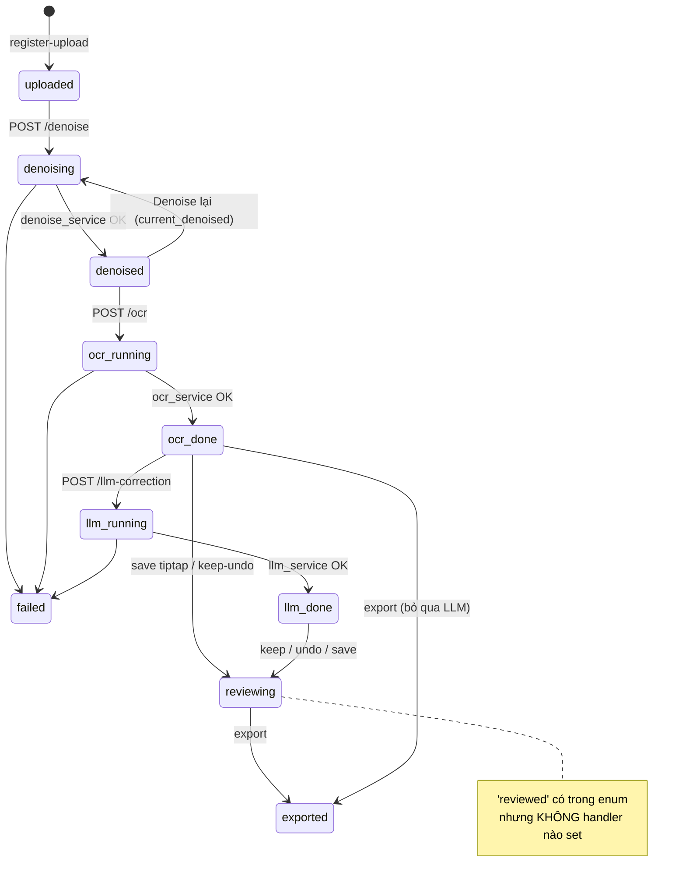

# 00 — Tổng quan: Luồng chạy xuyên suốt Frontend ↔ Backend ↔ Database

> File điểm-vào (index) của bộ tài liệu. Mô tả **bức tranh tổng quát** và truy vết **từng chức năng** đi qua cả 3 tầng: UI (Next.js) → API/Worker (FastAPI/Celery) → Database (PostgreSQL).
> Chi tiết sâu hơn: [01 — Backend](01_LUONG_CHAY_BACKEND.md) · [02 — Frontend](02_LUONG_CHAY_FRONTEND.md) · [03 — Hàm ↔ Database](03_CHUC_NANG_HAM_VA_DATABASE.md).

---

## 1. Kiến trúc tổng thể

```mermaid
flowchart TB
    subgraph FE["🖥️ FRONTEND — Next.js 16 / React 19"]
        UI[Trang & Component<br/>editor/[id], dashboard, auth]
        STORE[Zustand stores<br/>useAuth · useUploadStore]
        APICLIENT[lib/api/* + client.ts<br/>fetch wrapper + silent refresh]
        UI --> STORE --> APICLIENT
    end

    subgraph BE["⚙️ BACKEND — FastAPI"]
        EP[Endpoints /api/v1/*<br/>auth · documents · uploads · pages<br/>ocr · restoration · corrections · exports]
        DEPS[deps.py<br/>get_current_user · require_roles<br/>get_llm_provider_for_user]
        SVC[Services<br/>denoise · ocr · suspicious<br/>llm_correction · tiptap · export]
        EP --> DEPS
        EP --> SVC
    end

    subgraph WK["🔄 WORKERS — Celery + Redis"]
        T1[denoise_page_task]
        T2[ocr_page_task]
        T3[llm_correct_page_task]
    end

    subgraph AI["🧠 AI"]
        DN[U-Net denoise<br/>TensorFlow]
        OC[Tesseract OCR layout]
        LLM[LangChain chain<br/>OpenAI / OpenRouter]
    end

    DB[("🗄️ PostgreSQL<br/>13 bảng — pages là trung tâm")]
    CDN[["☁️ Cloudinary<br/>ảnh gốc + denoised + file export"]]

    APICLIENT -- "HTTPS Bearer JWT" --> EP
    APICLIENT -. "upload ảnh TRỰC TIẾP (signed)" .-> CDN
    EP -- enqueue --> WK
    SVC <--> DB
    WK --> SVC
    SVC --> AI
    SVC <--> CDN
    EP <--> DB
```

**3 nguyên tắc nền tảng:**
1. **Pipeline có điểm dừng** — mỗi bước AI (`denoise → OCR → LLM`) là 1 API riêng, user tự bấm, không tự chạy tiếp.
2. **Backend stateless** — mọi trạng thái nằm trên DB (chủ yếu bảng `pages` + `documents`); switch workspace chỉ là đổi `id`.
3. **Backend authoritative** — text cuối / kết quả Keep-Undo do backend tính & lưu; frontend chỉ refetch và hiển thị.

---

## 2. Luồng chạy tổng quát (end-to-end, có điểm dừng 🛑)

```mermaid
sequenceDiagram
    autonumber
    actor U as User
    participant FE as Frontend
    participant API as FastAPI
    participant CDN as Cloudinary
    participant Q as Celery/Redis
    participant W as Worker+AI
    participant DB as PostgreSQL

    Note over U,DB: ĐĂNG NHẬP
    U->>FE: login
    FE->>API: POST /auth/login
    API->>DB: SELECT users / INSERT refresh_tokens
    API-->>FE: access+refresh JWT (lưu cookie)

    Note over U,DB: TẠO WORKSPACE + UPLOAD (🛑 dừng ở uploaded)
    U->>FE: chọn ảnh
    FE->>API: POST /uploads/signature
    API->>DB: check ownership + quota (users.images_used)
    API-->>FE: chữ ký Cloudinary
    FE->>CDN: PUT ảnh (trực tiếp, XHR progress)
    FE->>API: POST /documents/{id}/pages/register-upload
    API->>DB: INSERT pages(status=uploaded) · UPDATE total_pages, images_used

    Note over U,DB: DENOISE (🛑 user bấm; có thể download & dừng)
    U->>FE: Run Denoise
    FE->>API: POST /pages/{id}/denoise
    API->>DB: UPDATE pages.status=denoising
    API->>Q: enqueue denoise_page_task
    W->>CDN: tải ảnh nguồn
    W->>W: U-Net denoise (patch-based)
    W->>CDN: upload ảnh denoised _v{n}
    W->>DB: UPDATE pages(denoised_url, denoise_version, status=denoised) · INSERT denoise_attempts
    loop poll mỗi 2s
        FE->>API: GET /pages/{id}/status
    end

    Note over U,DB: OCR (🛑 user bấm)
    U->>FE: Run OCR
    FE->>API: POST /pages/{id}/ocr
    API->>Q: enqueue ocr_page_task
    W->>W: Tesseract layout OCR
    W->>DB: DELETE+INSERT ocr_words · UPDATE pages(ocr_document_json, ocr_plain_text, tiptap_json, final_text, status=ocr_done)
    FE->>API: GET /pages/{id}/ocr (render TipTap, gạch chân từ nghi ngờ)

    Note over U,DB: LLM CORRECTION (🛑 user bấm — tuỳ chọn)
    U->>FE: Run LLM Correction
    FE->>API: POST /pages/{id}/llm-correction
    API->>API: get_llm_provider_for_user(role)
    API->>Q: enqueue llm_correct_page_task(page_id, role)
    W->>W: detect_chunks → chain.batch (OpenAI/OpenRouter)
    W->>DB: DELETE+INSERT corrections(status=pending) · UPDATE pages.status=llm_done

    Note over U,DB: REVIEW Keep/Undo (🛑 backend tính lại)
    loop mỗi gợi ý
        U->>FE: Keep / Undo
        FE->>API: POST /corrections/{id}/keep|undo
        API->>DB: UPDATE corrections.status · recompute_review → UPDATE pages(final_text, tiptap_json, status=reviewing)
        FE->>API: refetch page + corrections
    end

    Note over U,DB: EXPORT (chỉ User/Admin)
    U->>FE: Export DOCX/PDF
    FE->>API: POST /documents/{id}/export/docx|pdf
    API->>API: require PaidUser (viewer → 403)
    API->>DB: SELECT pages(final_text) · INSERT exports · UPDATE pages.status=exported
    API->>CDN: upload file
    API-->>FE: file_url → mở tab mới
```

---

## 3. Bảng truy vết từng chức năng qua 3 tầng

> Đọc theo hàng: một chức năng = UI gọi gì → API/Service xử lý gì → DB đọc/ghi bảng nào.

### 3.1. Tài khoản & phiên

| Chức năng | Frontend | Backend (endpoint → service) | Database |
|---|---|---|---|
| Đăng ký | `register/page.tsx` → `useAuth.register` → `api.auth.register` | `POST /auth/register` | READ `users` · WRITE `users`, `refresh_tokens` |
| Đăng nhập | `login/page.tsx` → `useAuth.login` → `api.auth.login` | `POST /auth/login` | READ `users` · WRITE `refresh_tokens` |
| Giữ phiên (auto) | `client.ts` gặp 401 → silent refresh | `POST /auth/refresh` (xoay vòng) | READ/WRITE `refresh_tokens`, READ `users` |
| Hydrate user | `(dashboard)/layout.tsx` → `useAuth.hydrate` → `api.auth.me` | `GET /users/me` (`get_current_user`) | READ `users` |
| Đăng xuất | `useAuth.logout` → `api.auth.logout` | `POST /auth/logout` | WRITE `refresh_tokens.revoked_at` |

### 3.2. Workspace (Document)

| Chức năng | Frontend | Backend | Database |
|---|---|---|---|
| List workspace | `/dashboard`, `/history` → `api.documents.list` | `GET /documents` | READ `documents` |
| Tạo workspace | `editor/new` picker / `useUploadStore.startUpload` → `api.documents.create` | `POST /documents` (quota viewer ≤ 2) | READ+WRITE `documents` |
| Mở workspace | `editor/[id]` → `api.documents.get` + `api.pages.list` | `GET /documents/{id}` · `GET /documents/{id}/pages` | READ `documents`, `pages` |
| Lưu state UI | (chưa nối) | `PATCH /documents/{id}/ui-state` → **501 stub** | (lẽ ra WRITE `documents.ui_state`) |
| Xoá workspace | `api.documents.archive` | `DELETE /documents/{id}` (soft) | WRITE `documents.status=archived` |

### 3.3. Upload trang

| Chức năng | Frontend | Backend | Database |
|---|---|---|---|
| Xin chữ ký upload | `PageUploadPanel` → `api.uploads.sign` | `POST /uploads/signature` (validate type/size/quota) | READ `documents`, `users.images_used` |
| Upload ảnh | `api.uploads.toCloudinary` (XHR → **Cloudinary trực tiếp**) | — (không qua backend) | — |
| Ghi nhận page | `api.uploads.register` | `POST /documents/{id}/pages/register-upload` | WRITE `pages(status=uploaded)`, `documents.total_pages`, `users.images_used` |

### 3.4. Denoise (khử nhiễu)

| Chức năng | Frontend | Backend | Database |
|---|---|---|---|
| Chạy denoise | `handleDenoise` → `api.pages.denoise` → `runAndWait` | `POST /pages/{id}/denoise` → enqueue `denoise_page_task` → `denoise_service.denoise_page` | WRITE `pages(status, denoised_url, denoise_version, …)`, `denoise_attempts` |
| Theo dõi tiến độ | poll `api.pages.pollStatus` (2s) | `GET /pages/{id}/status` | READ `pages` |
| So sánh trước/sau | `BeforeAfterCompare` (slider wipe) | — (dùng `original_url`/`denoised_url`) | — |
| Download & dừng | nút mở `api.pages.downloadUrl` | `GET /pages/{id}/download?type=` | READ `pages` |

### 3.5. OCR

| Chức năng | Frontend | Backend | Database |
|---|---|---|---|
| Chạy OCR | `handleRunOcr` → `api.ocr.trigger` → `runAndWait` | `POST /pages/{id}/ocr` → `ocr_page_task` → `ocr_service.ocr_page` (Tesseract) | DELETE+WRITE `ocr_words` · WRITE `pages(ocr_document_json, ocr_plain_text, tiptap_json, final_text, status=ocr_done)` |
| Xem kết quả | `api.ocr.get` → render `CorrectionReviewEditor` | `GET /pages/{id}/ocr` | READ `pages`, COUNT `ocr_words` |
| Phát hiện từ nghi ngờ | gạch chân `ocr-low-conf` theo `low_confidence_words` | trong `ocr_service`: `is_suspicious = conf < THRESHOLD(70)` | WRITE `ocr_words.is_suspicious` |
| Chỉnh tay & lưu | "Save text" → `api.ocr.saveTiptap` | `PATCH /pages/{id}/tiptap` (`tiptap_to_plain_text`) | WRITE `pages(tiptap_json, final_text, status→reviewing)` |

### 3.6. LLM Correction + Review

| Chức năng | Frontend | Backend | Database |
|---|---|---|---|
| Chạy LLM sửa lỗi | `handleRunLlm` → `api.corrections.trigger` | `POST /pages/{id}/llm-correction` → `llm_correct_page_task(page_id, role)` → `llm_correction_service` (detect_chunks → `chain.batch`) | READ `ocr_words` · DELETE+WRITE `corrections(pending)` · WRITE `pages.status=llm_done` |
| Xem danh sách gợi ý | `api.corrections.list` (card original→suggested) | `GET /corrections/by-page/{id}` | READ `corrections` |
| Keep / Undo | `reviewSuggestion` → `api.corrections.keep\|undo` → refetch + bump revision | `POST /corrections/{id}/keep\|undo` → `recompute_review` | WRITE `corrections(status, reviewed_*)`, `pages(final_text, tiptap_json, status=reviewing)` |
| Lấy text cuối | (`api.corrections.finalText` — chưa dùng UI) | `GET /corrections/by-page/{id}/final-text` (`build_final_text`) | READ `corrections(kept)`, `pages`/`ocr_words` |

### 3.7. Export

| Chức năng | Frontend | Backend | Database |
|---|---|---|---|
| Xuất DOCX/PDF | `handleExport` → `api.exports.docx\|pdf` → mở `file_url` | `POST /documents/{id}/export/docx\|pdf` (`PaidUser`) → `export_service.build_docx/pdf` | READ `pages(final_text)` · WRITE `exports`, `pages.status=exported` |
| Chặn viewer | nút ẩn với viewer | dependency `PaidUser` → 403 | — |

### 3.8. Phân quyền & quota (xuyên suốt)

| Cơ chế | Frontend | Backend | Database |
|---|---|---|---|
| Gác route | `middleware.ts` (cookie `denoise_token`) | `get_current_user` mọi route protected | READ `users` |
| Chọn provider LLM | hint UI (free vs OpenAI) | `get_llm_provider_for_user(role)` (server-side, client không truyền được) | (đọc `users.role` đã load) |
| Quota viewer | hiển thị `images_used` | `register-upload` & `documents.create` chặn ≤ 10 ảnh / 2 workspace | READ/WRITE `users.images_used`, COUNT `documents` |
| Blur text viewer | (FE phủ blur theo `blurred`) | `final-text` trả `blurred = role==viewer` | — |

---

## 4. "Đường đi" của dữ liệu chính qua các tầng

### Ảnh
```
File (browser) ──signed──▶ Cloudinary (original)
                                  │ denoise_task tải về
                                  ▼
                            U-Net (TensorFlow)
                                  │ upload _denoised_v{n}
                                  ▼
                      Cloudinary (denoised)  ◀── pages.denoised_url / denoise_version
```

### Văn bản (text)
```
ảnh denoised ──Tesseract──▶ OCRDocument (layout block→para→line→word)
                                  │
        ┌─────────────────────────┼─────────────────────────────┐
        ▼                         ▼                              ▼
  ocr_words (offset)      pages.ocr_plain_text (KHO CHUẨN)   pages.tiptap_json (editor)
        │                         │                              ▲
        │ low-confidence          │ apply_corrections (offset)   │ recompute_review
        ▼                         ▼                              │
  corrections (LLM, pending) ─Keep▶ corrections.kept ───────────┘
                                  │
                                  ▼
                          pages.final_text ──▶ DOCX / PDF (export)
```

`pages.ocr_plain_text` là **kho text chuẩn**; `ocr_words.start_offset/end_offset` và `corrections.start_offset/end_offset` đều trỏ vào đây. `final_text` và `tiptap_json` luôn được dựng lại đồng bộ qua `recompute_review` sau mỗi Keep/Undo.

---

## 5. Máy trạng thái trang (`pages.status`) — sợi chỉ xuyên suốt



- Mỗi mũi tên có nhãn `POST /...` là **điểm dừng** — user phải bấm mới đi tiếp.
- `failed` đạt được từ bất kỳ bước worker nào (lưu kèm `pages.processing_error`).
- Nhánh `ocr_done → exported`: user thấy OCR ổn, **bỏ qua LLM**, export luôn.

---

## 6. Lưu ý quan trọng (đã hiện thực vs chưa)

| Nhóm | Trạng thái |
|---|---|
| ✅ Đã chạy đầy đủ | Auth, workspace, upload, denoise, OCR, LLM correction, Keep/Undo, export, quota viewer |
| ⚠️ Khai báo nhưng **chưa nối** | `documents.ui_state` (PATCH 501), admin endpoints (toàn 501), trạng thái `reviewed`/`processing`/`ready` |
| 💤 **Schema chết** (không code dùng) | `feedback`, `subscription_plans`, `user_subscriptions`, `payments`, `audit_logs` |
| 🧩 Frontend song song | code thật (nối backend) + code mock cũ (`mock-data.ts`, `/admin`, `/settings`, `text-editor.tsx`) |
| 🔒 Cần cải thiện | token lưu cookie không httpOnly; chưa có rate-limit thật (`slowapi` chưa wire) |

---

## 7. Bản đồ tài liệu

| File | Khi nào đọc |
|---|---|
| **00 — Tổng quan** (file này) | Muốn thấy bức tranh xuyên suốt 3 tầng & truy vết nhanh từng chức năng |
| [01 — Backend](01_LUONG_CHAY_BACKEND.md) | Đào sâu endpoint, service, worker, AI pipeline, tổ chức folder backend |
| [02 — Frontend](02_LUONG_CHAY_FRONTEND.md) | Đào sâu route, component, store, api client, tổ chức folder frontend |
| [03 — Hàm ↔ Database](03_CHUC_NANG_HAM_VA_DATABASE.md) | Schema 13 bảng, ERD, ma trận hàm↔bảng, cách dựng final_text |
