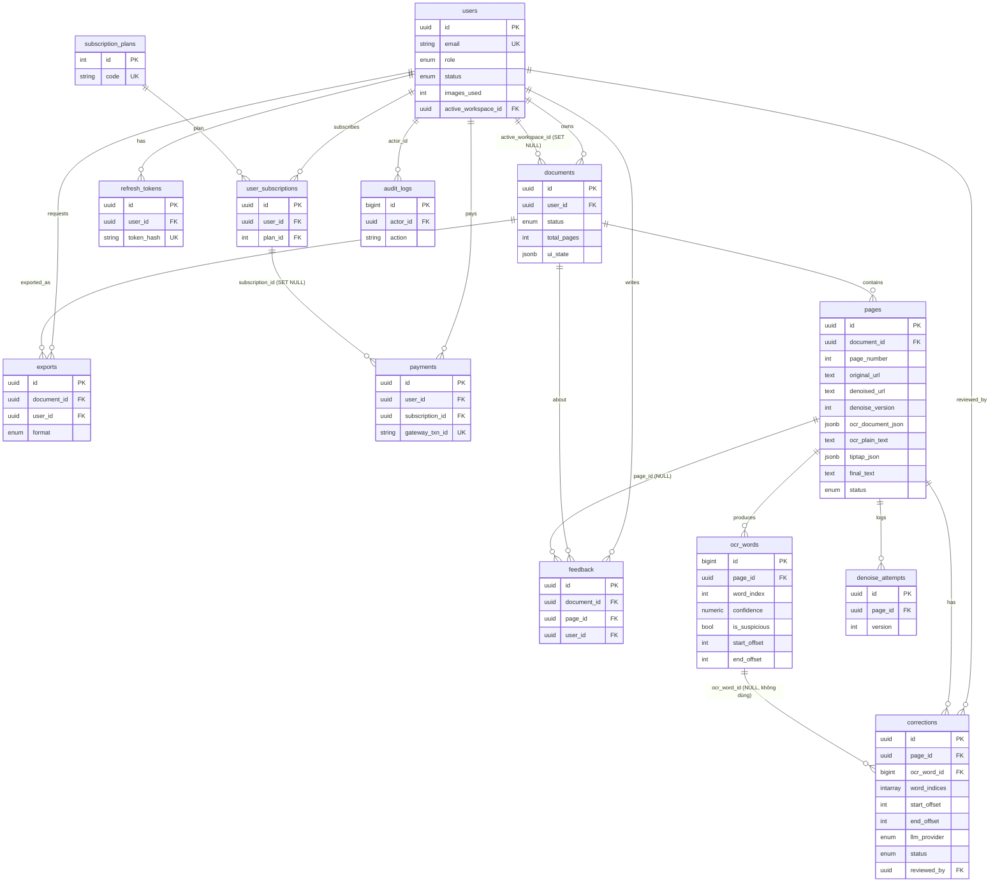

# 03 — Chức năng hoạt động: Hàm tương tác với Database

> Tầng dữ liệu của hệ thống **Denoise + OCR + LLM Correction**: **SQLAlchemy 2.0 (sync) · Alembic · PostgreSQL**.
> Mô tả **schema thực tế** (model + migration), quan hệ thực thể (ERD), và **ma trận hàm ↔ bảng** (hàm nào đọc/ghi bảng nào). Dựa trên **code thực tế**, ghi chú nơi lệch `README.md`.

---

## 0. Tóm tắt nhanh

- **13 bảng** sau 2 migration (README nói 12 — migration `0002` thêm bảng thứ 13: `denoise_attempts`).
- SQLAlchemy **đồng bộ** (không async). Endpoint dùng dependency `get_db()`; **worker tự tạo `SessionLocal()`** và tự quản transaction.
- **Không có repository layer** — mọi truy vấn nằm inline trong endpoint/service.
- `pages` là bảng **trung tâm**: chứa cả ảnh (`original_url`/`denoised_url`), layout OCR (`ocr_document_json`), text (`ocr_plain_text`/`final_text`) và doc editor (`tiptap_json`).
- Text cuối được dựng theo **offset** từ `ocr_plain_text` + correction `kept` (không phải nối từng từ trừ đường legacy).
- **5 bảng "schema chết"** (chưa code dùng): `feedback`, `subscription_plans`, `user_subscriptions`, `payments`, `audit_logs`.

---

## 1. Hạ tầng DB

### Engine / Session — [backend/app/database/session.py](../backend/app/database/session.py)
- **Sync** SQLAlchemy: `create_engine(settings.DATABASE_URL, pool_pre_ping=True, echo=DEBUG&dev, future=True)`.
- `SessionLocal = sessionmaker(bind=engine, autocommit=False, autoflush=False, expire_on_commit=False)` — `expire_on_commit=False` cho phép dùng object ORM sau `commit()`.
- `get_db()` — generator dependency, yield `SessionLocal()`, đóng ở `finally`; **không tự commit/rollback** (endpoint/service commit tường minh).
- Worker/service **bỏ qua `get_db()`**, tạo `SessionLocal()` trực tiếp.

### Base ORM — [backend/app/database/base.py](../backend/app/database/base.py)
- `Base(DeclarativeBase)` (style 2.0 `Mapped[]`/`mapped_column`).
- `UUIDPKMixin` (UUID PK, default `uuid4`); `TimestampMixin` (`created_at`/`updated_at` server-side, `timezone=True`).

### Alembic — [backend/alembic/env.py](../backend/alembic/env.py)
- `target_metadata = Base.metadata`; `from app.models import *` (đăng ký mọi model).
- DB URL inject runtime: `config.set_main_option("sqlalchemy.url", settings.DATABASE_URL)`.
- `compare_type=True`, `compare_server_default=True`; online dùng `NullPool`.

### Repositories
[backend/app/repositories/](../backend/app/repositories/) chỉ có `__init__.py` rỗng → **không có repository pattern**.

---

## 2. ENUM types — [backend/app/models/enums.py](../backend/app/models/enums.py)

Tất cả là `str, enum.Enum`, lưu dưới native PG enum:

| PG enum | Python | Giá trị |
|---|---|---|
| `user_role` | `UserRole` | `admin`, `user`, `viewer` |
| `user_status` | `UserStatus` | `active`, `banned`, `pending` |
| `document_status` | `DocumentStatus` | `draft`, `processing`, `ready`, `archived` |
| `page_status` | `PageStatus` | `uploaded`, `denoising`, `denoised`, `ocr_running`, `ocr_done`, `llm_running`, `llm_done`, **`reviewing`**, **`reviewed`**, **`exported`**, `failed` |
| `correction_status` | `CorrectionStatus` | `pending`, `kept`, `undone` |
| `llm_provider` | `LLMProvider` | `openai`, `openrouter_qwen` |
| `export_format` | `ExportFormat` | `docx`, `pdf` |
| `subscription_status` | `SubscriptionStatus` | `active`, `expired`, `cancelled` |
| `payment_gateway` | `PaymentGateway` | `vnpay`, `momo`, `stripe` |
| `payment_status` | `PaymentStatus` | `pending`, `success`, `failed`, `refunded` |

> **Migration:** `0001_initial.py` chỉ có 8 giá trị `page_status` (tới `llm_done`, `failed`). [0002_direct_upload_layout_ocr_tiptap.py](../backend/alembic/versions/0002_direct_upload_layout_ocr_tiptap.py) thêm `reviewing`, `reviewed`, `exported` bằng `ALTER TYPE ... ADD VALUE` trong `autocommit_block()` (downgrade không xoá được enum value).

---

## 3. Schema thực tế (model ✕ migration)

### `users` — [user.py](../backend/app/models/user.py)
| Cột | Kiểu | Ràng buộc |
|---|---|---|
| `id` | UUID | PK |
| `email` | String(255) | UNIQUE, NOT NULL, indexed |
| `password_hash` | String(255) | NOT NULL (argon2) |
| `full_name` | String(150) | NULL |
| `role` | enum `user_role` | NOT NULL, default `viewer`, indexed |
| `status` | enum `user_status` | NOT NULL, default `active`, indexed |
| `images_used` | Integer | NOT NULL, default 0 (quota viewer) |
| `active_workspace_id` | UUID | NULL, FK → `documents.id` `SET NULL` (`use_alter`, FK vòng) |
| `last_login_at` | DateTime(tz) | NULL — **không code nào ghi** |
| `created_at`/`updated_at` | DateTime(tz) | TimestampMixin |

Quan hệ: `documents` 1–N (cascade delete-orphan), `refresh_tokens` 1–N (cascade).

### `refresh_tokens` — [refresh_token.py](../backend/app/models/refresh_token.py)
`id` UUID PK · `user_id` FK→users CASCADE indexed · `token_hash` String(255) UNIQUE indexed (sha256) · `expires_at` · `revoked_at` NULL (set khi logout/xoay vòng) · `user_agent`/`ip` NULL · `created_at` (không có `updated_at`).

### `documents` — [document.py](../backend/app/models/document.py) ("workspace = 1 cuốn sách")
| Cột | Kiểu | Ghi chú |
|---|---|---|
| `id` | UUID PK | |
| `user_id` | UUID FK→users CASCADE, indexed | |
| `title` | String(255) NOT NULL | |
| `description` | Text NULL | |
| `status` | enum `document_status`, default `draft`, indexed | |
| `total_pages` | Integer, default 0 | tăng khi register-upload |
| `ui_state` | JSONB NULL | state UI (endpoint PATCH là 501 stub) |
| `last_opened_at` | DateTime(tz) NULL | **không code nào ghi** |
| `created_at`/`updated_at` | TimestampMixin | |

Index `ix_documents_user_recent` trên `(user_id, last_opened_at)`. Quan hệ: `owner` N–1, `pages`/`feedbacks`/`exports` 1–N.

### `pages` — [page.py](../backend/app/models/page.py) (★ trung tâm pipeline)
| Cột | Kiểu | Nguồn |
|---|---|---|
| `id` | UUID PK | 0001 |
| `document_id` | UUID FK→documents CASCADE, indexed | 0001 |
| `page_number` | Integer NOT NULL | 0001 |
| `cloudinary_public_id` | String(255) NULL (ảnh gốc) | 0001 |
| `original_url` | Text NOT NULL | 0001 |
| `denoised_url` | Text NULL (ảnh denoised hiện tại, ghi đè mỗi lần) | 0001 |
| `current_denoised_cloudinary_public_id` | String(255) NULL | **0002** |
| `denoise_version` | Integer, default 0 | **0002** |
| `file_size_kb`/`width`/`height` | Integer NULL | 0001 |
| `ocr_document_json` | JSONB NULL (cây block→para→line→word) | **0002** |
| `ocr_plain_text` | Text NULL (text OCR chuẩn; offset trỏ vào đây) | **0002** |
| `tiptap_json` | JSONB NULL (doc ProseMirror cho editor) | **0002** |
| `final_text` | Text NULL (OCR + correction kept + chỉnh tay; nguồn export) | **0002** |
| `status` | enum `page_status`, default `uploaded`, indexed | 0001 (+enum 0002) |
| `processing_error` | Text NULL | 0001 |
| `completed_at` | DateTime(tz) NULL | 0001 |
| `created_at`/`updated_at` | TimestampMixin | 0001 |

`UniqueConstraint(document_id, page_number)`; index `ix_pages_document`, `ix_pages_status`. Quan hệ: `document` N–1; `ocr_words`/`corrections`/`denoise_attempts` 1–N (cascade delete-orphan).

> **README vs thực tế:** README §4.4 chỉ liệt kê cột 0001. **6 cột 0002** (`denoise_version`, `current_denoised_cloudinary_public_id`, `ocr_document_json`, `ocr_plain_text`, `tiptap_json`, `final_text`) là trái tim của pipeline layout-OCR + Tiptap nhưng không có trong phần schema README.

### `ocr_words` — [ocr_word.py](../backend/app/models/ocr_word.py) (**BigInt PK, không TimestampMixin**)
| Cột | Kiểu | Nguồn |
|---|---|---|
| `id` | BigInteger PK autoincrement | 0001 |
| `page_id` | UUID FK→pages CASCADE NOT NULL | 0001 |
| `word_index` | Integer NOT NULL | 0001 |
| `text` | Text NOT NULL | 0001 |
| `confidence` | Numeric(5,2) NOT NULL — **thang 0..100** | 0001 |
| `bbox` | JSONB NULL `{x,y,w,h}` | 0001 |
| `line_number` | Integer NULL | 0001 |
| `is_suspicious` | Boolean default false | 0001 |
| `start_offset`/`end_offset` | Integer NULL — offset ký tự vào `pages.ocr_plain_text` | **0002** |
| `created_at` | DateTime(tz) server_default now | 0001 |

Index: `ix_ocr_words_page_word (page_id, word_index)`; partial `ix_ocr_words_suspicious (page_id) WHERE is_suspicious=true`. Quan hệ: `page` N–1; `corrections` 1–N.

### `corrections` — [correction.py](../backend/app/models/correction.py) (chỉ có `created_at`)
| Cột | Kiểu | Nguồn |
|---|---|---|
| `id` | UUID PK | 0001 |
| `page_id` | UUID FK→pages CASCADE NOT NULL | 0001 |
| `ocr_word_id` | BigInteger FK→ocr_words CASCADE **NULL** (luôn ghi `None`) | 0001 |
| `word_indices` | ARRAY(INTEGER) **NULL** (0001 NOT NULL → 0002 nullable) | 0001→0002 |
| `start_offset`/`end_offset` | Integer NULL — span ký tự (handle chính) | **0002** |
| `original_text` | Text NOT NULL | 0001 |
| `suggested_text` | Text NOT NULL | 0001 |
| `reason` | Text NULL | 0001 |
| `llm_provider` | enum `llm_provider` NOT NULL | 0001 |
| `llm_model` | String(100) NOT NULL | 0001 |
| `confidence_score` | Numeric(5,2) NULL | 0001 |
| `status` | enum `correction_status`, default `pending` | 0001 |
| `reviewed_at` | DateTime(tz) NULL | 0001 |
| `reviewed_by` | UUID FK→users SET NULL, NULL | 0001 |
| `created_at` | DateTime(tz) server_default now | 0001 |

Index `ix_corrections_page_status (page_id, status)`.
> **Lệch migration:** `word_indices` từ NOT NULL (0001) → nullable (0002) khi offset trở thành handle chính.

### `denoise_attempts` — [denoise_attempt.py](../backend/app/models/denoise_attempt.py) (**chỉ tạo ở 0002**, log debug)
`id` UUID PK · `page_id` FK→pages CASCADE indexed · `version` Integer · `source_image_url`/`output_image_url`/`output_cloudinary_public_id` Text NULL · `params_json` JSONB NULL · `created_at`. Không bao giờ hiển thị cho user.

### `feedback` — [feedback.py](../backend/app/models/feedback.py)
`id` UUID PK · `document_id` FK→documents CASCADE indexed · `page_id` FK→pages CASCADE NULL · `user_id` FK→users CASCADE · `note` Text · TimestampMixin. **Không endpoint/service nào dùng.**

### `exports` — [export.py](../backend/app/models/export.py)
`id` UUID PK · `document_id` FK→documents CASCADE indexed · `user_id` FK→users CASCADE · `format` enum `export_format` · `file_url` Text NOT NULL · `file_size_kb` Integer NULL · `created_at`.

### `subscription_plans` / `user_subscriptions` — [subscription.py](../backend/app/models/subscription.py)
- `subscription_plans`: `id` Integer PK · `code` String(30) UNIQUE · `name` · `price_vnd` · `duration_days` · `features` JSONB NULL · `is_active` Boolean · `created_at`. **Không relationship.**
- `user_subscriptions`: `id` UUID PK · `user_id` FK→users CASCADE indexed · `plan_id` Integer FK→subscription_plans **RESTRICT** · `status` enum default `active` · `starts_at`/`ends_at` NOT NULL · `created_at`.

### `payments` — [payment.py](../backend/app/models/payment.py)
`id` UUID PK · `user_id` FK→users CASCADE indexed · `subscription_id` FK→user_subscriptions **SET NULL** NULL · `gateway` enum · `gateway_txn_id` String(100) UNIQUE indexed · `amount_vnd` · `status` enum default `pending` · `raw_payload` JSONB · `created_at`/`paid_at`.

### `audit_logs` — [audit_log.py](../backend/app/models/audit_log.py)
`id` BigInteger PK · `actor_id` UUID FK→users **SET NULL** NULL · `action` String(50) indexed · `target_type`/`target_id` NULL · `metadata_` → cột DB **`metadata`** JSONB NULL · `ip` INET NULL · `created_at` indexed. **Không code nào ghi** (admin write là 501 stub).

---

## 4. Quan hệ thực thể (ERD)



**Tóm tắt FK / cardinality:**
- `users` 1–N `documents`/`refresh_tokens`/`feedback`/`exports`/`user_subscriptions`/`payments`/`audit_logs`. + FK vòng `users.active_workspace_id` N–1 `documents` (SET NULL).
- `documents` 1–N `pages`/`feedback`/`exports`.
- `pages` 1–N `ocr_words`/`corrections`/`denoise_attempts` + `feedback` (optional).
- `ocr_words` 1–N `corrections` (nhưng `ocr_word_id` luôn `None` → quan hệ thực tế không dùng; correction nối từ qua `word_indices`/offset).
- `corrections.reviewed_by` N–1 `users` (SET NULL).
- `subscription_plans` 1–N `user_subscriptions` (RESTRICT); `user_subscriptions` 1–N `payments` (SET NULL).

---

## 5. ★ Ma trận Hàm ↔ Bảng (Reads / Writes)

| Hàm / Endpoint | Đọc (READ) | Ghi (WRITE) | Ghi chú |
|---|---|---|---|
| **`auth.register`** `POST /auth/register` | `users` (check email) | `users` INSERT, `refresh_tokens` INSERT | Luôn tạo `viewer` (`status=active`) |
| **`auth.login`** `POST /auth/login` | `users` (theo email) | `refresh_tokens` INSERT | Verify argon2; chặn banned. **Không** update `last_login_at` |
| **`auth.refresh`** `POST /auth/refresh` | `refresh_tokens` (theo hash), `users` | `refresh_tokens` UPDATE revoke cũ + INSERT mới | Xoay vòng token |
| **`auth.logout`** `POST /auth/logout` | `refresh_tokens` | `refresh_tokens` UPDATE `revoked_at` | Best-effort |
| **`auth.dev_login`** (dev) | `users` | `users` INSERT/UPDATE role | Chỉ trả access token |
| **`get_current_user`** (deps, mọi route protected) | `users` (`db.get`) | — | Chặn banned |
| **`users.get_me`** `GET /users/me` | (dùng `CurrentUser` đã load) | — | Không query thêm |
| **`documents.list_workspaces`** | `documents` (theo user, chưa archived) | — | |
| **`documents.create_workspace`** | `documents` (đếm cho quota viewer) | `documents` INSERT | Viewer ≤ `VIEWER_MAX_WORKSPACES=2` |
| **`documents.get_workspace`** | `documents` (`db.get`) | — | Ownership check |
| **`documents.patch_ui_state`** | — | — | **501 stub** (lẽ ra ghi `documents.ui_state`) |
| **`documents.archive_workspace`** `DELETE` | `documents` | `documents` UPDATE `status=archived` | Soft delete |
| **`uploads.create_upload_signature`** | `documents` (ownership), `users.images_used` (in-memory) | — | Validate type/size/quota → trả chữ ký Cloudinary |
| **`uploads.register_upload`** | `documents` (ownership), `pages` (MAX page_number) | `pages` INSERT, `documents` UPDATE `total_pages`, `users` UPDATE `images_used` | `status=uploaded`, **không auto-denoise** |
| **`pages.trigger_denoise`** `POST /pages/{id}/denoise` | `pages`, `documents` (ownership) | `pages` UPDATE `status=denoising`, clear lỗi | Rồi enqueue `denoise_page_task` |
| **`denoise_service.denoise_page`** (worker) | `pages` (`db.get`) | `pages` UPDATE (`status`, `denoised_url`, `current_denoised_cloudinary_public_id`, `denoise_version`, `width/height`, `completed_at`), `denoise_attempts` INSERT | Lỗi → `status=failed` + `processing_error` |
| **`pages.list_pages`/`get_page`/`get_page_status`** | `pages`, `documents` | — | |
| **`pages.download_page`** | `pages`, `documents` | — | Redirect Cloudinary / stream local |
| **`ocr.trigger_ocr`** `POST /pages/{id}/ocr` | `pages`, `documents` | — | Chỉ enqueue `ocr_page_task` |
| **`ocr_service.ocr_page`** (worker) | `pages` (`db.get`) | `pages` UPDATE (`status` ocr_running→ocr_done, `ocr_document_json`, `ocr_plain_text`, `tiptap_json`, `final_text`), `ocr_words` **DELETE all** rồi bulk INSERT | `is_suspicious = confidence < THRESHOLD`. Lỗi → `failed` |
| **`ocr.get_ocr_result`** `GET /pages/{id}/ocr` | `pages`, `documents`, `ocr_words` (COUNT suspicious) | — | Trả layout + tiptap + plain + suspicious_count |
| **`ocr.save_tiptap`** `PATCH /pages/{id}/tiptap` | `pages`, `documents` | `pages` UPDATE (`tiptap_json`, `final_text`, có thể `status→reviewing`) | Lưu chỉnh tay |
| **`suspicious_detector_service.detect_chunks`** | — (list `OcrWord` truyền vào) | — | Hàm thuần, gom cụm từ nghi ngờ |
| **`restoration.trigger_llm_correction`** `POST /pages/{id}/llm-correction` | `pages`, `documents` | — | Enqueue `llm_correct_page_task`; provider chọn server-side theo role |
| **`llm_correction_service.llm_correct_page`** (worker) | `pages` (`db.get`), `ocr_words` (theo page, ordered) | `pages` UPDATE (`status` llm_running→llm_done), `corrections` **DELETE all** rồi INSERT mỗi suggestion (`status=pending`) | Bỏ suggestion == original. Lỗi → `failed` |
| **`corrections.list_corrections`** `GET /corrections/by-page/{id}` | `pages`, `documents`, `corrections` | — | Optional `?status=` |
| **`corrections.get_final_text`** `GET .../final-text` | `pages`, `documents`, `corrections` (kept), `ocr_words` (chỉ fallback legacy) | — | `build_final_text`; `blurred=True` cho viewer |
| **`corrections.keep_correction`/`undo_correction`** | `corrections`, `pages`, `documents` | `corrections` UPDATE (`status`, `reviewed_at`, `reviewed_by`), `pages` UPDATE (`final_text`, `tiptap_json` qua `recompute_review`; có thể `status→reviewing`) | |
| **`corrections.bulk_review`** `POST /corrections/bulk` | như keep/undo theo từng id | `corrections` UPDATE nhiều, `pages` recompute | accept→kept, reject→undone |
| **`tiptap_service`** (mọi hàm) | — | — | Hàm chuyển đổi thuần; Tiptap JSON nằm ở **`pages.tiptap_json`** (ghi bởi ocr_service/save_tiptap/recompute_review) |
| **`export_service.build_docx/build_pdf`** | — (đọc `Page` truyền vào: `final_text`→`tiptap_json`→`ocr_plain_text`) | — | Hàm render thuần |
| **`exports.export_docx/export_pdf`** `POST /documents/{id}/export/*` | `documents` (ownership), `pages` (tất cả, ordered) | `exports` INSERT, `pages` UPDATE `status=exported` (mọi page) | **`PaidUser`** (viewer 403). Upload Cloudinary / stream |
| **`admin.*`** | — | — | **Tất cả 501 stub** (`update_user` lẽ ra ghi `users` + `audit_logs`) |

**Quan sát chính:**
- `feedback`, `subscription_plans`, `user_subscriptions`, `payments`, `audit_logs` **không có code runtime đọc/ghi**.
- `corrections.ocr_word_id` **luôn ghi `None`** — nối OCR qua `word_indices` (legacy) + `start_offset`/`end_offset` (chính), không qua FK.
- `users.last_login_at` và `documents.last_opened_at` được khai báo nhưng **không bao giờ được update**.

---

## 6. Vòng đời trạng thái (State lifecycle)

### `page_status` — transitions thực tế trong code
```
register_upload         → uploaded
trigger_denoise (EP)    uploaded|denoised|ocr_done|llm_done|reviewing|reviewed|failed → denoising
denoise_service         denoising → denoised   | lỗi → failed (+processing_error)
ocr_service             → ocr_running → ocr_done | lỗi → failed
llm_correct_page        → llm_running → llm_done (kể cả 0 suggestion) | lỗi → failed
save_tiptap             {ocr_done|llm_done} → reviewing
corrections keep/undo   {ocr_done|llm_done} → reviewing
exports                 (mọi page của document) → exported
```
> ⚠️ **`reviewed` không bao giờ được set** bởi bất kỳ handler nào (enum có giá trị, được chấp nhận như *input* trong vài guard, nhưng review chỉ dừng ở `reviewing`). `denoising` bị set ở 2 nơi (endpoint + service).

### `correction_status`
- `pending` — INSERT bởi `llm_correct_page` (mỗi suggestion mới).
- `kept` — `keep_correction` / bulk accept (+ `reviewed_at`, `reviewed_by`).
- `undone` — `undo_correction` / bulk reject.
- Chạy lại LLM → **DELETE all** correction của page (cả pending lẫn kept) rồi INSERT lại `pending`.

### `document_status`
Giá trị: `draft`, `processing`, `ready`, `archived`. Thực tế chỉ set `draft` (tạo) và `archived` (xoá). **`processing`/`ready` không bao giờ được set.**

---

## 7. Cách dựng Text cuối (final / corrected text)

Logic ở [llm_correction_service.py](../backend/app/services/llm_correction_service.py) + [tiptap_service.py](../backend/app/services/tiptap_service.py):

### (a) Đường offset (hiện hành)
1. `_kept_corrections(db, page_id)` → query `corrections WHERE page_id=? AND status='kept'`, sắp theo `start_offset`.
2. Mỗi correction kept → tuple `(start_offset, end_offset, suggested_text)`.
3. `tiptap_service.apply_corrections(page.ocr_document_json, page.ocr_plain_text, corrs)`:
   - `_apply_range` duyệt `ocr_plain_text` từ offset 0, chèn suggestion vào span `[start, end)` (bỏ qua span chồng lấn/ngoài range) → **`final_text`**.
   - Dựng lại Tiptap doc theo từng paragraph (suy range từ offset từ đầu/cuối paragraph), gắn `attrs` (`blockId`, `paragraphId`, `bbox`, `confidence`, `range`) → **`tiptap_json`**.
4. **`recompute_review(db, page)`** ghi cả `page.final_text` và `page.tiptap_json`. Được gọi sau mọi keep/undo/bulk → page luôn **backend-authoritative**; frontend chỉ refetch.
5. **`build_final_text(db, page_id)`** trả `final_text` đã recompute cho endpoint `GET .../final-text` (không persist).

### (b) Fallback word-index (legacy)
Nếu `ocr_plain_text` là `None` (page OCR trước nâng cấp layout): load `ocr_words` theo `word_index`, dựng map `{word_index → suggested_text}` từ `word_indices` của correction kept, nối text theo space — đúng mô tả README §4.6.

### Quan hệ Tiptap JSON ↔ final text
- Kho text chuẩn = **`pages.ocr_plain_text`** (offset của `ocr_words`/`corrections` trỏ vào đây).
- **`pages.tiptap_json`** (doc editor) được dựng song song và giữ đồng bộ với `final_text` qua `apply_corrections`/`recompute_review`.
- Lưu chỉnh tay (`PATCH /pages/{id}/tiptap`) đi ngược lại: lưu `tiptap_json` của client nguyên trạng và suy `final_text` qua `tiptap_to_plain_text`.
- **Export** đọc theo page: `final_text` → `tiptap_json` → `ocr_plain_text`, theo thứ tự `page_number`, mỗi trang 1 page break. Không dựng lại từ `ocr_words` thô.

---

## 8. Tổng hợp lệch thiết kế

1. **Số bảng: README "12 bảng" nhưng thực tế 13** (sau `0002` thêm `denoise_attempts`).
2. **6 cột `pages` + 2 cột mỗi bảng `ocr_words`/`corrections`** không có trong schema README, nhưng là cốt lõi pipeline layout-OCR + Tiptap + Keep/Undo theo offset (thêm ở `0002`).
3. **`corrections.word_indices`** từ NOT NULL (0001) → nullable (0002).
4. **5 bảng schema chết**: `feedback`, `subscription_plans`, `user_subscriptions`, `payments`, `audit_logs`.
5. **`corrections.ocr_word_id` không bao giờ được điền** (luôn `None`).
6. **Cột không bao giờ ghi:** `users.last_login_at`, `documents.last_opened_at`. **Trạng thái không bao giờ đạt:** `document_status` = `processing`/`ready`; `page_status` = `reviewed`.
7. **Không có repository layer** — data access inline trong endpoint/service.
8. SQLAlchemy **sync** xuyên suốt; worker tự tạo `SessionLocal()` và tự quản transaction (độc lập với `get_db()`).

---

### Tham chiếu file
`database/session.py` · `database/base.py` · `alembic/env.py` · `alembic/versions/0001_initial.py` · `alembic/versions/0002_direct_upload_layout_ocr_tiptap.py` · `models/*.py` · `services/{denoise,ocr,llm_correction,suspicious_detector,tiptap,export}_service.py` · `workers/{denoise,ocr,llm_correction}_task.py` · `api/v1/endpoints/*.py` · `api/deps.py` · `core/security.py`

> Xem **file 01** (luồng backend) và **file 02** (luồng frontend) để có bức tranh đầy đủ.
